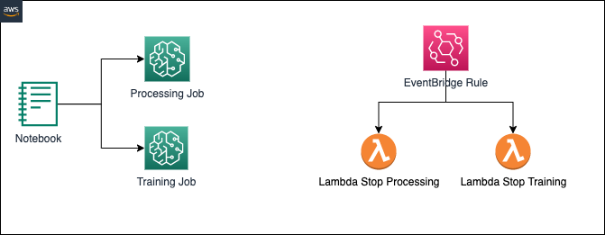
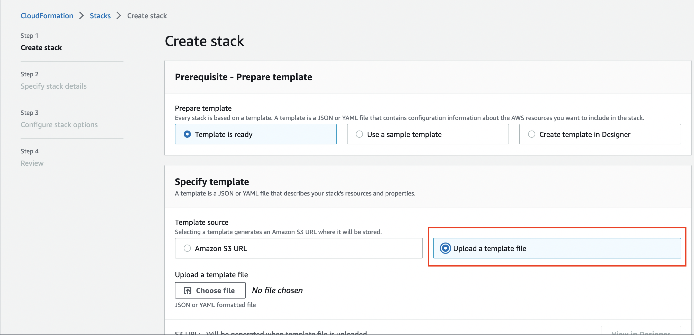
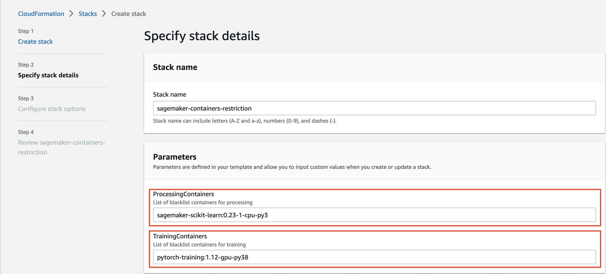
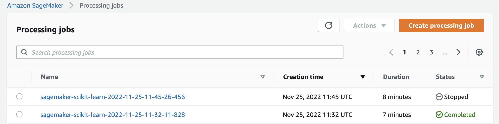
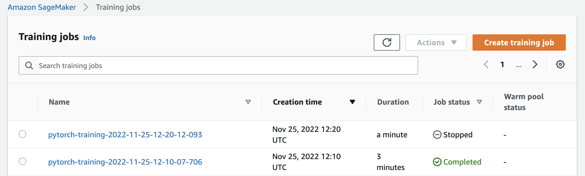

# SageMaker Job - Limit unauthorized container images

Amazon SageMaker provides [prebuilt Docker images](https://docs.aws.amazon.com/sagemaker/latest/dg/docker-containers-prebuilt.html) 
for the most popular Machine Learning (ML) frameworks.

This solution allows to control the execution of Amazon SageMaker Jobs (Processing and Training), by defining unauthorized SageMaker container images.

In this example we will provide an easy solution for controlling the usage of Framework containers, by defining a list of 
not allowed Docker images by using Amazon EventBridge and AWS Lambda.

## Solution Architecture

1. Two Amazon EventBridge Rules are monitoring the SageMaker Job executions for Processing and Training
2. Each time a new job is executed, a specific AWS Lambda function is invoked
3. The Lambda function is checking the SageMaker Image in the unapproved list provided in the environment variable
4. The Lambda function stops the job

## Setup

In this example, we are providing Infrastructure as Code (IaC) templates for provisioning the necessary resources required 
for the solution.

We are providing an example [template](./cloudformation/template.yml), by using [AWS CloudFormation](https://docs.aws.amazon.com/en_en/AWSCloudFormation/latest/UserGuide/Welcome.html) in order to deploy the following resources:

* IAM Policy and Role for the AWS Lambda functions
* Two AWS Lambda Functions for managing the SageMaker Training and Processing Jobs
* Two EventBridge Rules that are monitoring the SageMaker Jobs started

### Step 1

Create a new CloudFormation stack by uploading the [template.yml](./cloudformation/template.yml)

### Step 2

Insert the list of images for SageMaker Processing and Training you want to restrict

## Examples

Use the notebook example provided for testing the solution.

### SageMaker Processing Notebook

For testing this notebook, you should create the CloudFormation Stack by providing the following value for **ProcessingContainers** parameter:

**ProcessingContainers**: sagemaker-scikit-learn:0.23-1-cpu-py3

Please refer to the [notebook](./SageMaker-Processing-Example.ipynb)

### SageMaker Training Notebook

For testing this notebook, you should create the CloudFormation Stack by providing the following value for **TrainingContainers** parameter:

**TrainingContainers**: pytorch-training:1.10-cpu-py38

Please refer to the [notebook](./SageMaker-Training-Example.ipynb)

## Maintainers

[Bruno Pistone](https://github.com/brunopistone) - AI/ML Specialist Solutions Architect, based in Milan, Italy.

[Engincan Meydan](https://github.com/engincan-meydan) - Technical Business Development Manager, based in Madrid, Spain.